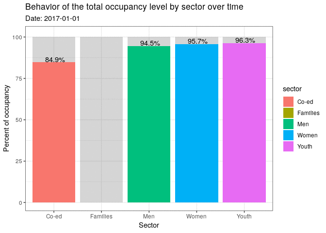

\#TidyTuesday 2020 week 49
================

# Libraries

``` r
library(dplyr)
```

    ## 
    ## Attaching package: 'dplyr'

    ## The following objects are masked from 'package:stats':
    ## 
    ##     filter, lag

    ## The following objects are masked from 'package:base':
    ## 
    ##     intersect, setdiff, setequal, union

``` r
library(ggplot2)
library(gganimate)
```

# Get the Data

``` r
tuesdata <- tidytuesdayR::tt_load('2020-12-01')
```

    ## --- Compiling #TidyTuesday Information for 2020-12-01 ----

    ## --- There is 1 file available ---

    ## --- Starting Download ---

    ## 
    ##  Downloading file 1 of 1: `shelters.csv`

    ## --- Download complete ---

``` r
shelters <- tuesdata$shelters
```

# Introduce the data

``` r
DataExplorer::introduce(shelters, add_percent = T)
```

    ##                         Count % of total
    ## discrete_columns           10      76.92
    ## continuous_columns          3      23.08
    ## all_missing_columns         0       0.00
    ## columns                    13         NA
    ## complete_rows          110079      94.96
    ## rows                   115916         NA
    ## total_missing_values     5837       0.39
    ## infinite_values             0       0.00
    ## nan_values                  0       0.00
    ## total_observations    1506908         NA
    ## memory_usage         12100072         NA

``` r
str(shelters)
```

    ## tibble [115,916 × 13] (S3: spec_tbl_df/tbl_df/tbl/data.frame)
    ##  $ id                 : num [1:115916] 1 2 3 4 5 6 7 8 9 10 ...
    ##  $ occupancy_date     : POSIXct[1:115916], format: "2017-01-01" "2017-01-01" ...
    ##  $ organization_name  : chr [1:115916] "COSTI Immigrant Services" "Christie Ossington Neighbourhood Centre" "Christie Ossington Neighbourhood Centre" "Christie Refugee Welcome Centre, Inc." ...
    ##  $ shelter_name       : chr [1:115916] "COSTI Reception Centre" "Christie Ossington Men's Hostel" "Christie Ossington Men's Hostel" "Christie Refugee Welcome Centre" ...
    ##  $ shelter_address    : chr [1:115916] "100 Lippincott Street" "973 Lansdowne Avenue" "973 Lansdowne Avenue" "43 Christie Street" ...
    ##  $ shelter_city       : chr [1:115916] "Toronto" "Toronto" "Toronto" "Toronto" ...
    ##  $ shelter_province   : chr [1:115916] "ON" "ON" "ON" "ON" ...
    ##  $ shelter_postal_code: chr [1:115916] "M5S 2P1" "M6H 3Z5" "M6H 3Z5" "M6G 3B1" ...
    ##  $ facility_name      : chr [1:115916] "COSTI Reception Centre" "Christie Ossington Men's Hostel" "Christie Ossington Men's Hostel" "Christie Refugee Welcome Centre" ...
    ##  $ program_name       : chr [1:115916] "COSTI Reception Ctr CITY Program" "Christie Ossington Extreme Weather Program" "Christie Ossington Men's Hostel" "Christie Refugee Welcome Ctr - Settlement and Support" ...
    ##  $ sector             : chr [1:115916] "Co-ed" "Men" "Men" "Families" ...
    ##  $ occupancy          : num [1:115916] 16 13 63 66 58 168 119 23 8 14 ...
    ##  $ capacity           : num [1:115916] 16 17 63 70 60 160 150 28 0 40 ...
    ##  - attr(*, "spec")=
    ##   .. cols(
    ##   ..   id = col_double(),
    ##   ..   occupancy_date = col_datetime(format = ""),
    ##   ..   organization_name = col_character(),
    ##   ..   shelter_name = col_character(),
    ##   ..   shelter_address = col_character(),
    ##   ..   shelter_city = col_character(),
    ##   ..   shelter_province = col_character(),
    ##   ..   shelter_postal_code = col_character(),
    ##   ..   facility_name = col_character(),
    ##   ..   program_name = col_character(),
    ##   ..   sector = col_character(),
    ##   ..   occupancy = col_double(),
    ##   ..   capacity = col_double()
    ##   .. )

``` r
summary(shelters)
```

    ##        id        occupancy_date                organization_name 
    ##  Min.   :    1   Min.   :2017-01-01 00:00:00   Length:115916     
    ##  1st Qu.: 9660   1st Qu.:2017-09-30 00:00:00   Class :character  
    ##  Median :19320   Median :2018-07-03 00:00:00   Mode  :character  
    ##  Mean   :19326   Mean   :2018-07-04 07:19:55                     
    ##  3rd Qu.:28979   3rd Qu.:2019-04-09 00:00:00                     
    ##  Max.   :39446   Max.   :2019-12-31 00:00:00                     
    ##                                                                  
    ##  shelter_name       shelter_address    shelter_city       shelter_province  
    ##  Length:115916      Length:115916      Length:115916      Length:115916     
    ##  Class :character   Class :character   Class :character   Class :character  
    ##  Mode  :character   Mode  :character   Mode  :character   Mode  :character  
    ##                                                                             
    ##                                                                             
    ##                                                                             
    ##                                                                             
    ##  shelter_postal_code facility_name      program_name          sector         
    ##  Length:115916       Length:115916      Length:115916      Length:115916     
    ##  Class :character    Class :character   Class :character   Class :character  
    ##  Mode  :character    Mode  :character   Mode  :character   Mode  :character  
    ##                                                                              
    ##                                                                              
    ##                                                                              
    ##                                                                              
    ##    occupancy         capacity     
    ##  Min.   :  0.00   Min.   :  0.00  
    ##  1st Qu.: 13.00   1st Qu.: 16.00  
    ##  Median : 37.00   Median : 40.00  
    ##  Mean   : 56.97   Mean   : 60.53  
    ##  3rd Qu.: 69.00   3rd Qu.: 71.00  
    ##  Max.   :826.00   Max.   :902.00  
    ##                   NA's   :343

``` r
head(shelters)
```

    ## # A tibble: 6 x 13
    ##      id occupancy_date      organization_na… shelter_name shelter_address
    ##   <dbl> <dttm>              <chr>            <chr>        <chr>          
    ## 1     1 2017-01-01 00:00:00 COSTI Immigrant… COSTI Recep… 100 Lippincott…
    ## 2     2 2017-01-01 00:00:00 Christie Ossing… Christie Os… 973 Lansdowne …
    ## 3     3 2017-01-01 00:00:00 Christie Ossing… Christie Os… 973 Lansdowne …
    ## 4     4 2017-01-01 00:00:00 Christie Refuge… Christie Re… 43 Christie St…
    ## 5     5 2017-01-01 00:00:00 City of Toronto  Birchmount … 1673 Kingston …
    ## 6     6 2017-01-01 00:00:00 City of Toronto  Birkdale Re… 1229 Ellesmere…
    ## # … with 8 more variables: shelter_city <chr>, shelter_province <chr>,
    ## #   shelter_postal_code <chr>, facility_name <chr>, program_name <chr>,
    ## #   sector <chr>, occupancy <dbl>, capacity <dbl>

``` r
tail(shelters)
```

    ## # A tibble: 6 x 13
    ##      id occupancy_date      organization_na… shelter_name shelter_address
    ##   <dbl> <dttm>              <chr>            <chr>        <chr>          
    ## 1 39440 2019-12-31 00:00:00 YWCA Toronto     YWCA - Firs… 80 Woodlawn Av…
    ## 2 39442 2019-12-31 00:00:00 YWCA Toronto     YWCA-348 Da… 348 Davenport …
    ## 3 39443 2019-12-31 00:00:00 Youth Without S… Youth Witho… 6 Warrendale C…
    ## 4 39444 2019-12-31 00:00:00 Youth Without S… Youth Witho… 6 Warrendale C…
    ## 5 39445 2019-12-31 00:00:00 YouthLink        YouthLink S… 747 Warden Ave 
    ## 6 39446 2019-12-31 00:00:00 YouthLink        YouthLink S… 747 Warden Ave 
    ## # … with 8 more variables: shelter_city <chr>, shelter_province <chr>,
    ## #   shelter_postal_code <chr>, facility_name <chr>, program_name <chr>,
    ## #   sector <chr>, occupancy <dbl>, capacity <dbl>

``` r
shelters %>% 
  group_by(id, organization_name) %>% 
  count()
```

    ## # A tibble: 103,939 x 3
    ## # Groups:   id, organization_name [103,939]
    ##       id organization_name                           n
    ##    <dbl> <chr>                                   <int>
    ##  1     1 COSTI Immigrant Services                    3
    ##  2     2 Christie Ossington Neighbourhood Centre     1
    ##  3     2 COSTI Immigrant Services                    2
    ##  4     3 Christie Ossington Neighbourhood Centre     1
    ##  5     3 COSTI Immigrant Services                    2
    ##  6     4 Christie Refugee Welcome Centre, Inc.       1
    ##  7     4 COSTI Immigrant Services                    2
    ##  8     5 Christie Ossington Neighbourhood Centre     2
    ##  9     5 City of Toronto                             1
    ## 10     6 Christie Ossington Neighbourhood Centre     2
    ## # … with 103,929 more rows

``` r
table(shelters$shelter_province)
```

    ## 
    ##     ON 
    ## 115916

``` r
table(shelters$sector)
```

    ## 
    ##    Co-ed Families      Men    Women    Youth 
    ##    18759    17221    37336    24319    18281

``` r
table(shelters$shelter_city)
```

    ## 
    ##   Etobicoke  North York Scarborough     Toronto 
    ##        2190        3285        2387      108054

# selecting variables

``` r
shelts <- shelters %>% 
  group_by(
    date = zoo::as.yearmon(occupancy_date),
    sector
  ) %>% 
  summarise(
    occupancy = mean(occupancy)/mean(capacity)*100
  ) %>% 
  ungroup()
```

    ## `summarise()` regrouping output by 'date' (override with `.groups` argument)

``` r
table(shelts$sector)
```

    ## 
    ##    Co-ed Families      Men    Women    Youth 
    ##       36       36       36       36       36

# Animated plot

``` r
sectors <- ggplot(shelts)+
  geom_col(aes(sector, 100), alpha = 0.25)+
  geom_col(aes(sector, occupancy, fill=sector))+
  labs(title = 'Behavior of the total occupancy level by sector over time', subtitle = 'Date: {frame_time}', x = 'Sector', y = 'Percent of occupancy') +
  geom_text(aes(sector, occupancy*1.02, label = paste0(format(occupancy, digits = 1, nsmall = 1), '%')), position = position_dodge(width = 1)) +
  transition_time(zoo::as.Date(date))+
  theme_bw()

animate(sectors)
```

    ## Warning: Removed 18 rows containing missing values (position_stack).

    ## Warning: Removed 1 rows containing missing values (geom_text).
    
    ## Warning: Removed 1 rows containing missing values (geom_text).
    
    ## Warning: Removed 1 rows containing missing values (geom_text).
    
    ## Warning: Removed 1 rows containing missing values (geom_text).
    
    ## Warning: Removed 1 rows containing missing values (geom_text).
    
    ## Warning: Removed 1 rows containing missing values (geom_text).
    
    ## Warning: Removed 1 rows containing missing values (geom_text).
    
    ## Warning: Removed 1 rows containing missing values (geom_text).
    
    ## Warning: Removed 1 rows containing missing values (geom_text).
    
    ## Warning: Removed 1 rows containing missing values (geom_text).
    
    ## Warning: Removed 1 rows containing missing values (geom_text).
    
    ## Warning: Removed 1 rows containing missing values (geom_text).
    
    ## Warning: Removed 1 rows containing missing values (geom_text).
    
    ## Warning: Removed 1 rows containing missing values (geom_text).
    
    ## Warning: Removed 1 rows containing missing values (geom_text).
    
    ## Warning: Removed 1 rows containing missing values (geom_text).
    
    ## Warning: Removed 1 rows containing missing values (geom_text).
    
    ## Warning: Removed 1 rows containing missing values (geom_text).
    
    ## Warning: Removed 1 rows containing missing values (geom_text).
    
    ## Warning: Removed 1 rows containing missing values (geom_text).
    
    ## Warning: Removed 1 rows containing missing values (geom_text).
    
    ## Warning: Removed 1 rows containing missing values (geom_text).
    
    ## Warning: Removed 1 rows containing missing values (geom_text).
    
    ## Warning: Removed 1 rows containing missing values (geom_text).
    
    ## Warning: Removed 1 rows containing missing values (geom_text).
    
    ## Warning: Removed 1 rows containing missing values (geom_text).
    
    ## Warning: Removed 1 rows containing missing values (geom_text).
    
    ## Warning: Removed 1 rows containing missing values (geom_text).
    
    ## Warning: Removed 1 rows containing missing values (geom_text).
    
    ## Warning: Removed 1 rows containing missing values (geom_text).
    
    ## Warning: Removed 1 rows containing missing values (geom_text).
    
    ## Warning: Removed 1 rows containing missing values (geom_text).
    
    ## Warning: Removed 1 rows containing missing values (geom_text).
    
    ## Warning: Removed 1 rows containing missing values (geom_text).
    
    ## Warning: Removed 1 rows containing missing values (geom_text).

    ## Warning: Removed 5 rows containing missing values (geom_text).
    
    ## Warning: Removed 5 rows containing missing values (geom_text).
    
    ## Warning: Removed 5 rows containing missing values (geom_text).
    
    ## Warning: Removed 5 rows containing missing values (geom_text).

    ## Warning: Removed 1 rows containing missing values (geom_text).
    
    ## Warning: Removed 1 rows containing missing values (geom_text).
    
    ## Warning: Removed 1 rows containing missing values (geom_text).

<!-- -->

``` r
if(interactive()){
  anim_save('tidytuesday2020w49.gif')
}
```
